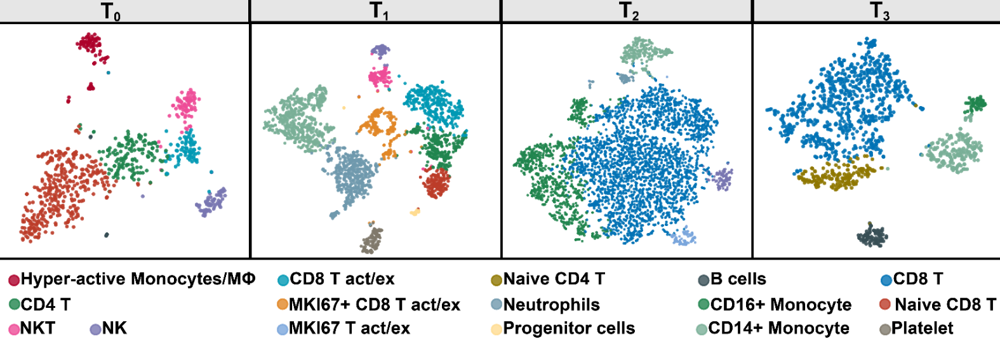

# Nivolumab-treatment-for-r-r-EBV-HLH

All single cell data in this paper was submitted with the scripts.

## Single cell Libraries constructed

Single cell RNA sequencing (scRNA-seq) was performed with peripheral blood cells before (Day 0, T0), during nivolumab treatment (Day 7, T1; Day 21, T2), and when plasma EBV turned negative (Day 76, T3) in 1 patient (patient 7). scRNA-seq libraries were generated following the recommended protocol of the 3’ scRNA-seq 10X genomics platform and using v2 chemistry, and sequenced data was collected by illumina NovaSeq 6000 sequencing.

## The format of submitted data

#### The .rds files generated by Seurat V3 were submitted. And the annotation information stored in meta.data. 

#### Consideration the limitation of github regulation (each file cannot bigger than 25Mb), so we splited all files in many individual files (10Mb). And after your downloading, you could use the code to merged them and compressed files. The code and example was as following:

~~~R
cat anno_HLH_T1.zip* > anno_HLH_T1.zip
unzip anno_HLH_T1.zip
~~~

And then you could export the rds.files in R

#### The output files generated by Cellranger were submitted.

#### The top markers in each cell types were submitted.

#### The scripts of figures making were submitted.

