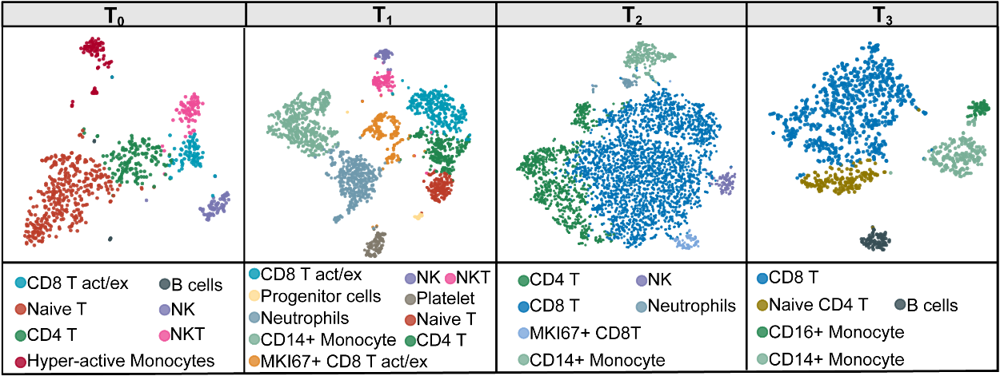
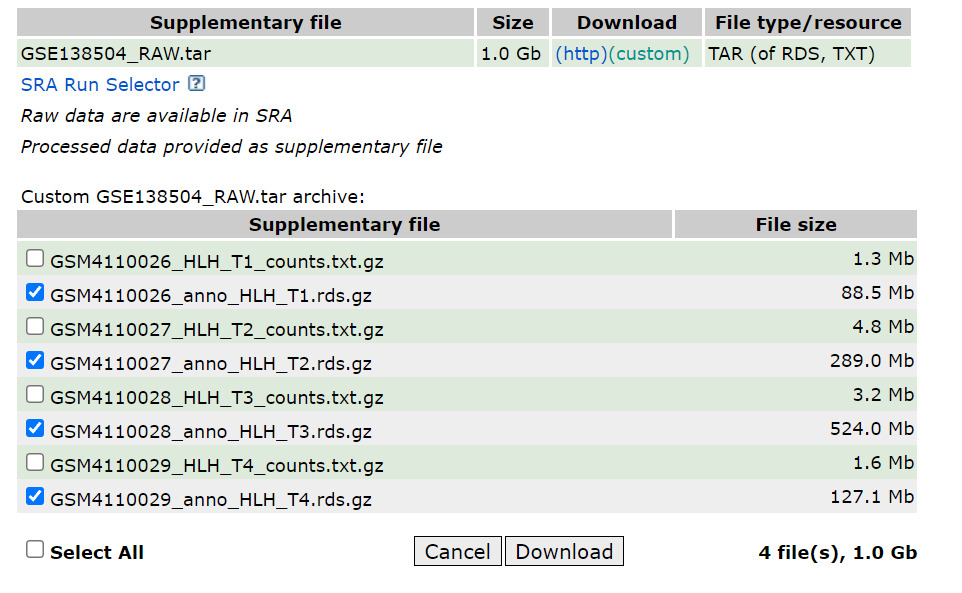
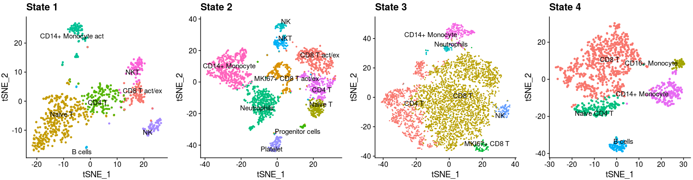
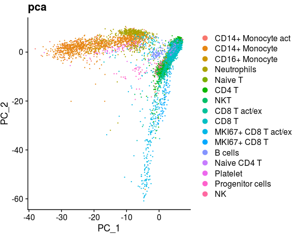
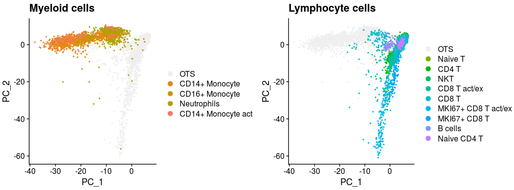
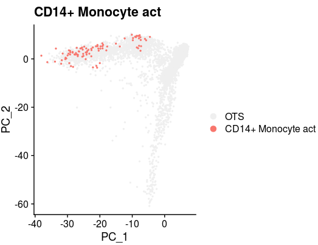
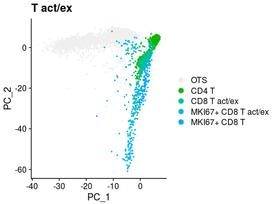
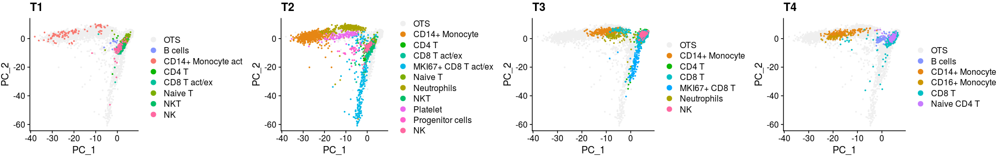
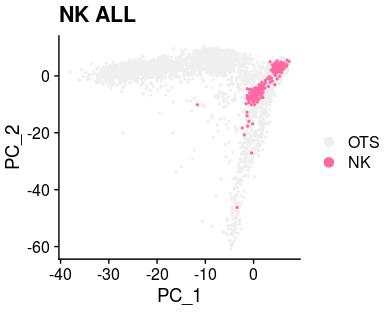
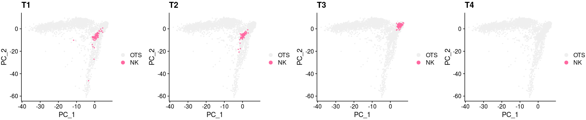

# Nivolumab-treatment-for-r-r-EBV-HLH

All single cell data in this paper was submitted with the scripts.

# Citation
Our paper has been published on the [Blood](https://ashpublications.org/blood) PMID [31914172](https://ashpublications.org/blood/article-abstract/doi/10.1182/blood.2019003886/430074/Nivolumab-treatment-for-relapsed-refractory?redirectedFrom=fulltext)

You could read our paper [here](README.assets/Liu-2020-Nivolumab-treatment-of-relapsed-ref.pdf), and all the supplemental materials are in [here](blood_publish/)

You could downloaded raw data from [GEO Database GSE138504](https://www.ncbi.nlm.nih.gov/geo/query/acc.cgi?acc=GSE138504) 

## Single cell Libraries constructed

Single cell RNA sequencing (scRNA-seq) was performed with peripheral blood cells before (Day 0, T0), during nivolumab treatment (Day 7, T1; Day 21, T2), and when plasma EBV turned negative (Day 76, T3) in 1 patient (patient 7). scRNA-seq libraries were generated following the recommended protocol of the 3’ scRNA-seq 10X genomics platform and using v2 chemistry, and sequenced data was collected by illumina NovaSeq 6000 sequencing.

---

## The version 2. Basic analysis of all merge data of HLH

To better visualize our data, we had modified a lot of functions from `Seurat`. If you want to used them, you need to loading them into your R environment.

~~~R
library(Seurat)
library(ggplot2)
library(cowplot)
source("./scripts/modified_Function_HLH.R")
~~~

Then, you could begin the data analyze from following codes. 

1. To repeat the figure mentioned and used in our paper, the `.rds` files could be downloaded from [GEO Database GSE138504](https://www.ncbi.nlm.nih.gov/geo/query/acc.cgi?acc=GSE138504)

   

   Then, you could use following codes to make the visualization. 

~~~R
HLH_T1 <- readRDS("/mnt/data/user_data/xiangyu/workshop/scRNA/human_pengpeng/result/accumlate_all/anno_HLH_T1.rds")
HLH_T2 <- readRDS("/mnt/data/user_data/xiangyu/workshop/scRNA/human_pengpeng/result/accumlate_all/anno_HLH_T2.rds")
HLH_T3 <- readRDS("/mnt/data/user_data/xiangyu/workshop/scRNA/human_pengpeng/result/accumlate_all/anno_HLH_T3.rds")
HLH_T4 <- readRDS("/mnt/data/user_data/xiangyu/workshop/scRNA/human_pengpeng/result/accumlate_all/anno_HLH_T4.rds")
p1 <- DimPlot(object = HLH_T1, reduction = "tsne", label = TRUE,repel=T) +NoLegend()+labs(title="State 1")
p2 <- DimPlot(object = HLH_T2, reduction = "tsne", label = TRUE,repel=T) +NoLegend()+labs(title="State 2")
p3 <- DimPlot(object = HLH_T3, reduction = "tsne", label = TRUE,repel=T) +NoLegend()+labs(title="State 3")
p4 <- DimPlot(object = HLH_T4, reduction = "tsne", label = TRUE,repel=T) +NoLegend()+labs(title="State 4")
plot_grid(p1,p2,p3,p4,nrow=1)
~~~

2. To make more analysis in our HLH scRNA-seq data, we integrated more tools and processing steps for analysis, including integrating  multiple samples and better visualization. 

​	Here is the code to merge all the data of HLH

~~~R
HLH_T1$group <- "T1"
HLH_T2$group <- "T2"
HLH_T3$group <- "T3"
HLH_T4$group <- "T4"
library(reticulate)
library(ReductionWrappers)
library(s2a)
all_data <- merge(x = HLH_T1, y = c(HLH_T2,HLH_T3,HLH_T4))
all_merge <- all_data %>%
    Seurat::NormalizeData(verbose = FALSE) %>%
    FindVariableFeatures(selection.method = "vst") %>% 
    ScaleData(verbose = TRUE) %>% 
    RunPCA(pc.genes = all_merge@var.genes, npcs = 30, verbose = FALSE)
all_merge <- all_merge %>% 
    RunUMAP(dims = 1:15) %>% 
    RunTSNE(dims = 1:15) %>% 
    FindNeighbors(dims = 1:15) %>% 
    FindClusters(resolution = 0.1) %>% 
    DoopenTSNE(reduction_use = "pca", reduction_save = "openTSNE",dims_use = 1:15) %>%
    DoPHATE(reduction_use = "pca", reduction_save = "phate",dims_use = 1:15) %>% 
    DoPhenoGraph(reduction_use = "pca", k = 500,prefix = "PhenoGraph")
all_merge <- XY_RunURD_DM(all_merge,assay = "RNA",key = "URDDM",sigma=15,visua_group="group")
all_merge <- DooptSNE(all_merge, reduction_use = "pca", reduction_save = "optsne",dims_use = 1:15)
all_merge <- DoForceAtlas2(all_merge, reduction_use = "pca", reduction_save = "fa2",dims_use = 1:15)
mcsaveRDS(all_merge,"/mnt/data/user_data/xiangyu/workshop/scRNA/human_pengpeng/result/20200624_seurat/all_merge.rds",mc.cores=20)
~~~

*And  the `.rds` files could be accessed from `./rds_files/all_merge.rds`*

~~~R
all_merge <- readRDS("/mnt/data/user_data/xiangyu/workshop/scRNA/human_pengpeng/result/20200624_seurat/all_merge.rds")
DimPlot(object = all_merge, reduction = "pca",label=FALSE,repel=TRUE,group.by="new_anno")+labs(title="pca")
~~~

~~~R
library(scales)
all_merge$new_anno <- factor(all_merge$new_anno,levels=c("CD14+ Monocyte act","CD14+ Monocyte",
  "CD16+ Monocyte","Neutrophils","Naive T","CD4 T","NKT",
  "CD8 T act/ex","CD8 T","MKI67+ CD8 T act/ex","MKI67+ CD8 T",
  "B cells","Naive CD4 T","Platelet","Progenitor cells","NK"))
col_sel <- hue_pal()(length(as.character(levels(all_merge$new_anno))))
col <- col_sel[1:length(as.character(levels(all_merge$new_anno)))]
names(col) <- as.character(levels(all_merge$new_anno))
col <- c(col,"#efefef")
names(col)[length(col)] <- "OTS"
all_merge$new_anno5 <- all_merge$new_anno
all_merge$new_anno5 <- as.character(all_merge$new_anno5)
all_merge$new_anno5[setdiff(1:length(all_merge$new_anno5),c(which(all_merge$new_anno5=="CD16+ Monocyte"),
  which(all_merge$new_anno5=="CD14+ Monocyte act"),
  which(all_merge$new_anno5=="CD14+ Monocyte"),
  which(all_merge$new_anno5=="Neutrophils")
  ))] <- "OTS"
all_merge$new_anno5 <- factor(all_merge$new_anno5,levels=c("OTS","CD14+ Monocyte","CD16+ Monocyte","Neutrophils","CD14+ Monocyte act"))
p1 <- XY_DimPlot(all_merge, reduction = 'pca', label = FALSE,repel=TRUE, pt.size = .5,group.by="new_anno5",cols=col[levels(all_merge$new_anno5)]) + labs(title="Myeloid cells")

all_merge$new_anno5 <- all_merge$new_anno
all_merge$new_anno5 <- as.character(all_merge$new_anno5)
all_merge$new_anno5[setdiff(1:length(all_merge$new_anno5),c(which(all_merge$new_anno5=="Naive T"),
  which(all_merge$new_anno5=="CD4 T"),
  which(all_merge$new_anno5=="NKT"),
  which(all_merge$new_anno5=="CD8 T act/ex"),
  which(all_merge$new_anno5=="CD8 T"),
  which(all_merge$new_anno5=="MKI67+ CD8 T act/ex"),
  which(all_merge$new_anno5=="B cells"),
  which(all_merge$new_anno5=="Naive CD4 T"),
  which(all_merge$new_anno5=="MKI67+ CD8 T")
  ))] <- "OTS"
all_merge$new_anno5 <- factor(all_merge$new_anno5,levels=c("OTS","Naive T","CD4 T","NKT",
  "CD8 T act/ex","CD8 T","MKI67+ CD8 T act/ex","MKI67+ CD8 T","B cells","Naive CD4 T"))
p2 <- XY_DimPlot(all_merge, reduction = 'pca', label = FALSE,repel=TRUE, pt.size = .5,group.by="new_anno5",cols=col[levels(all_merge$new_anno5)]) + labs(title="Lymphocyte cells")
plot_grid(p1,p2,nrow=1)
~~~

~~~R
all_merge$new_anno5 <- all_merge$new_anno
all_merge$new_anno5 <- as.character(all_merge$new_anno5)
all_merge$new_anno5[setdiff(1:length(all_merge$new_anno5),c(which(all_merge$new_anno5=="CD14+ Monocyte act")))] <- "OTS"
all_merge$new_anno5 <- factor(all_merge$new_anno5,levels=c("OTS","CD14+ Monocyte act"))
XY_DimPlot(all_merge, reduction = 'pca', label = FALSE,repel=TRUE, pt.size = .5,group.by="new_anno5",cols=col[levels(all_merge$new_anno5)]) + labs(title="CD14+ Monocyte act")
~~~

~~~R
all_merge$new_anno5 <- all_merge$new_anno
all_merge$new_anno5 <- as.character(all_merge$new_anno5)
all_merge$new_anno5[setdiff(1:length(all_merge$new_anno5),c(which(all_merge$new_anno5=="CD4 T"),
  which(all_merge$new_anno5=="CD8 T act/ex"),
  which(all_merge$new_anno5=="MKI67+ CD8 T act/ex"),
  which(all_merge$new_anno5=="MKI67+ CD8 T")
  ))] <- "OTS"
all_merge$new_anno5 <- factor(all_merge$new_anno5,levels=c("OTS","CD4 T","CD8 T act/ex","MKI67+ CD8 T act/ex","MKI67+ CD8 T"))
XY_DimPlot(all_merge, reduction = 'pca', label = FALSE,repel=TRUE, pt.size = .5,group.by="new_anno5",cols=col[levels(all_merge$new_anno5)]) + labs(title="T act/ex")
~~~

~~~R
all_merge$new_anno5 <- all_merge$new_anno
all_merge$new_anno5 <- as.character(all_merge$new_anno5)
all_merge$new_anno5[which(all_merge$group!="T1")] <- "OTS"
all_merge$new_anno5 <- factor(all_merge$new_anno5,levels=c("OTS","B cells","CD14+ Monocyte act","CD4 T","CD8 T act/ex","Naive T","NKT","NK"))
p1 <- XY_DimPlot(all_merge, reduction = 'pca', label = FALSE,repel=TRUE, pt.size = .5,group.by="new_anno5",cols=col[levels(all_merge$new_anno5)]) + labs(title="T1")
all_merge$new_anno5 <- all_merge$new_anno
all_merge$new_anno5 <- as.character(all_merge$new_anno5)
all_merge$new_anno5[which(all_merge$group!="T2")] <- "OTS"
all_merge$new_anno5 <- factor(all_merge$new_anno5,levels=c("OTS","CD14+ Monocyte","CD4 T","CD8 T act/ex","MKI67+ CD8 T act/ex","Naive T","Neutrophils","NKT","Platelet","Progenitor cells","NK"))
p2 <- XY_DimPlot(all_merge, reduction = 'pca', label = FALSE,repel=TRUE, pt.size = .5,group.by="new_anno5",cols=col[levels(all_merge$new_anno5)]) + labs(title="T2")
all_merge$new_anno5 <- all_merge$new_anno
all_merge$new_anno5 <- as.character(all_merge$new_anno5)
all_merge$new_anno5[which(all_merge$group!="T3")] <- "OTS"
all_merge$new_anno5 <- factor(all_merge$new_anno5,levels=c("OTS","CD14+ Monocyte","CD4 T","CD8 T","MKI67+ CD8 T","Neutrophils","NK"))
p3 <- XY_DimPlot(all_merge, reduction = 'pca', label = FALSE,repel=TRUE, pt.size = .5,group.by="new_anno5",cols=col[levels(all_merge$new_anno5)]) + labs(title="T3")
all_merge$new_anno5 <- all_merge$new_anno
all_merge$new_anno5 <- as.character(all_merge$new_anno5)
all_merge$new_anno5[which(all_merge$group!="T4")] <- "OTS"
all_merge$new_anno5 <- factor(all_merge$new_anno5,levels=c("OTS","B cells","CD14+ Monocyte","CD16+ Monocyte","CD8 T","Naive CD4 T"))
p4 <- XY_DimPlot(all_merge, reduction = 'pca', label = FALSE,repel=TRUE, pt.size = .5,group.by="new_anno5",cols=col[levels(all_merge$new_anno5)]) + labs(title="T4")
plot_grid(p1,p2,p3,p4,nrow=1)
~~~

~~~R
all_merge$new_anno5 <- all_merge$new_anno
all_merge$new_anno5 <- as.character(all_merge$new_anno5)
all_merge$new_anno5[setdiff(1:length(all_merge$new_anno5),c(which(all_merge$new_anno5=="NK")
  ))] <- "OTS"
all_merge$new_anno5 <- factor(all_merge$new_anno5,levels=c("OTS","NK"))
XY_DimPlot(all_merge, reduction = 'pca', label = FALSE,repel=TRUE, pt.size = .5,group.by="new_anno5",cols=col[levels(all_merge$new_anno5)])+ labs(title="NK ALL")
~~~

~~~R
all_merge$new_anno6 <- all_merge$new_anno5
all_merge$new_anno6 <- as.character(all_merge$new_anno6)
all_merge$new_anno6[which(all_merge$group!="T1")] <- "OTS"
all_merge$new_anno6 <- factor(all_merge$new_anno6,levels=c("OTS","NK"))
p1 <- XY_DimPlot(all_merge, reduction = 'pca', label = FALSE,repel=TRUE, pt.size = .5,group.by="new_anno6",cols=col[levels(all_merge$new_anno6)]) + labs(title="T1")
all_merge$new_anno6 <- all_merge$new_anno5
all_merge$new_anno6 <- as.character(all_merge$new_anno6)
all_merge$new_anno6[which(all_merge$group!="T2")] <- "OTS"
all_merge$new_anno6 <- factor(all_merge$new_anno6,levels=c("OTS","NK"))
p2 <- XY_DimPlot(all_merge, reduction = 'pca', label = FALSE,repel=TRUE, pt.size = .5,group.by="new_anno6",cols=col[levels(all_merge$new_anno6)]) + labs(title="T2")
all_merge$new_anno6 <- all_merge$new_anno5
all_merge$new_anno6 <- as.character(all_merge$new_anno6)
all_merge$new_anno6[which(all_merge$group!="T3")] <- "OTS"
all_merge$new_anno6 <- factor(all_merge$new_anno6,levels=c("OTS","NK"))
p3 <- XY_DimPlot(all_merge, reduction = 'pca', label = FALSE,repel=TRUE, pt.size = .5,group.by="new_anno6",cols=col[levels(all_merge$new_anno6)]) + labs(title="T3")
all_merge$new_anno6 <- all_merge$new_anno5
all_merge$new_anno6 <- as.character(all_merge$new_anno6)
all_merge$new_anno6[which(all_merge$group!="T4")] <- "OTS"
all_merge$new_anno6 <- factor(all_merge$new_anno6,levels=c("OTS","NK"))
p4 <- XY_DimPlot(all_merge, reduction = 'pca', label = FALSE,repel=TRUE, pt.size = .5,group.by="new_anno6",cols=col[levels(all_merge$new_anno6)]) + labs(title="T4")
plot_grid(p1,p2,p3,p4,nrow=1)
~~~

---

## The version 1. Overview of submitted data

#### The .rds files generated by Seurat V3 were submitted. And the annotation information stored in meta.data. 

#### Consideration the limitation of github regulation (each file cannot bigger than 25Mb), so we splited all files in many individual files (10Mb). And after your downloading, you could use the code to merged them and compressed files. The code and example were as following:

~~~R
cat anno_HLH_T1.zip* > anno_HLH_T1.zip
unzip anno_HLH_T1.zip
~~~

And then you could export the rds.files in R

#### The output files generated by Cellranger were submitted.

#### The top markers in each cell types were submitted.

#### The scripts of figures making were submitted.

